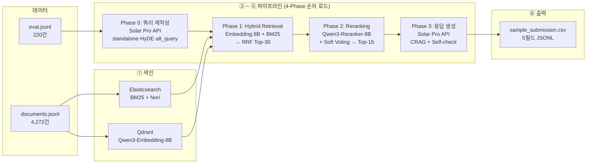

# IR — 과학 지식 RAG 경진대회 파이프라인

과학 상식 질의응답용 **RAG(Retrieval-Augmented Generation)** 파이프라인 저장소입니다.  
문서 색인 → 하이브리드 검색 → 재순위화 → LLM 응답 생성 → 대회 제출까지 한 흐름으로 구성되어 있습니다.

---

## 프로젝트 목표

`eval.jsonl`(220건 질문)에 대해 `documents.jsonl`(4,272편)에서 관련 문서를 검색하고,  
리더보드 평가 방식(**변형 MAP** — `topk` 상위 3개 docid 기준)에 맞는 제출 파일을 생성합니다.

> **로컬 MAP 한계**: 공개 데이터에 정답 docid(GT)가 없어 로컬 점수는 상대 비교용입니다.  
> 최종 순위는 제출 후 공식 결과를 기준으로 합니다.
>
> **최종 성능 (2026-04-22)**: ES 동의어 사전 한-한 항목 삭제·한-영만 유지 후 재색인(G-5) → 리더보드 **MAP=0.9311 / MRR=0.9333** — 참조 팀(0.9288) 초과. **프로젝트 완료.**

---

## 전체 파이프라인 아키텍처



---

## 폴더 구조

```
IR/
├── README.md
├── pyproject.toml              ← 패키지 메타데이터 (pytest pythonpath 포함)
├── .python-version             ← Python 3.10.x 권장
├── .env.example                ← 시크릿 템플릿 (ES_PASSWORD, HF_TOKEN, SOLAR_API_KEY 등)
├── .gitignore
├── requirements-train.txt      ← RAG 코어 + SFT 학습 (기본 venv)
├── requirements-vllm.txt       ← vLLM 서빙 전용 (별도 venv 필수)
│
├── config/
│   └── default.yaml            ← ES/Qdrant URL·인덱스·임베딩·Reranker·LLM 설정
│
├── data/                       ← 대회 데이터 (git 추적 제외)
│   ├── documents.jsonl
│   ├── eval.jsonl
│   └── sample_submission.csv
│
├── baseline_code/              ← 공식 베이스라인 (ES+임베딩+OpenAI)
│
├── artifacts/                  ← 생성물 (git 추적 제외)
│   ├── sample_submission.csv
│   ├── user_dict.txt
│   └── sft_data.jsonl
│
├── docs/
│   ├── RAG_Pipeline_Tech_Stack.md  ← 기술 스택·설계·모델 선택 근거
│   └── OPERATION.md                ← 운영 가이드 (명령어 순서·플로우차트)
│
├── scripts/
│   ├── index_es.py             ← documents.jsonl → Elasticsearch (Nori)
│   ├── index_qdrant.py         ← documents.jsonl → Qdrant (GPU 대용량) [--force]
│   ├── build_user_dict.py      ← MeCab → Nori 사용자 사전
│   ├── build_sft_data.py       ← eval+docs → Unsloth SFT 포맷
│   ├── train_sft.py            ← Unsloth QLoRA/bf16 LoRA + GGUF 내보내기
│   ├── serve_vllm.py           ← vLLM OpenAI 호환 API 서버
│   ├── export_submission.py    ← 제출 파일 생성 [--placeholder | --pipeline | --phase0-api solar …]
│   ├── verify_indices.py       ← ES·Qdrant 색인 건수·샘플 검색 점검
│   ├── validate_submission.py  ← 제출 행 필수 키 검사
│   ├── run_retrieval_eval.py   ← BM25 pseudo MAP (로컬 상대 비교)
│   ├── run_competition_map.py  ← 대회 변형 MAP (GT + 제출본)
│   ├── ragas_eval.py           ← RAGAS 품질 평가 + LangSmith 추적
│   └── smoke_e2e.py            ← ES 소규모 스모크 테스트
│
├── src/ir_rag/                 ← Python 패키지 (pip install -e . 으로 설치)
│   ├── config.py               ← load_config · validate_config · resolve_config_path
│   ├── io_util.py              ← iter_jsonl · write_jsonl
│   ├── preprocess.py           ← preprocess_science_doc (LaTeX·참고문헌 제거)
│   ├── query_rewrite.py        ← build_search_query · generate_alt_query · is_science_question
│   ├── llm_openai_chat.py      ← Solar Pro 등 OpenAI 호환 API → complete() 브릿지
│   ├── embeddings.py           ← build_huggingface_embedding (flash_attn/sdpa)
│   ├── es_util.py              ← ensure_index (Nori·user_dict 설정)
│   ├── retrieval.py            ← BM25 · Dense(Qdrant) · RRF · HyDE
│   ├── reranker.py             ← load_reranker · rerank_with_crossencoder · soft_voting_rerank
│   ├── generator.py            ← CRAG_PROMPT · generate_with_selfcheck
│   ├── pseudo_label.py         ← build_relevance_pseudo (임베딩+LLM 블렌딩)
│   ├── eval_map.py             ← evaluate_map · build_relevance_bm25
│   ├── competition_metrics.py  ← calc_map · load_gt_jsonl · load_submission_rows
│   ├── submission.py           ← SubmissionRecord · validate_submission_row
│   └── vram.py                 ← unload_model (순차 언로드)
│
└── tests/
    ├── test_competition_metrics.py
    ├── test_config.py
    ├── test_io_util.py
    ├── test_preprocess.py
    ├── test_query_rewrite.py
    └── test_submission.py
```

---

## 빠른 시작 (개발자)

```bash
# 1. 가상환경 + 패키지
python3.10 -m venv .venv && source .venv/bin/activate
pip install -e . && pip install -r requirements-train.txt

# 2. .env 설정 (.env.example 복사 후 수정)
cp .env.example .env
# ES_PASSWORD, HF_TOKEN 입력
# RAGAS Self-check용 API 키 (둘 중 하나, GOOGLE_API_KEY 우선):
#   GOOGLE_API_KEY=AIza...  ← Google AI Studio (무료 티어 가능)
#   OPENAI_API_KEY=sk-...   ← OpenAI (쿼터 초과 시 DISABLE_SELFCHECK=1 추가)

# 3. 검색 DB 기동 (OPERATION.md 2절 참고 — ES + Qdrant 직접 설치)
sudo systemctl start elasticsearch
./qdrant &

# 4. 색인
# ES: 메타·동의어 포함 재인덱싱 (F-2c 보완 버전 — doc_metadata.jsonl·science_synonyms.txt 사전 생성 필요)
python scripts/index_es.py --config config/default.yaml \
  --metadata artifacts/doc_metadata.jsonl \
  --synonyms artifacts/science_synonyms.txt \
  --lm-jelinek-mercer --recreate
# Qdrant: Embedding Instruction 도메인 강화 후 재인덱싱 (F-3)
python scripts/index_qdrant.py --config config/default.yaml --force   # GPU 필요

# 5. 동작 확인
python scripts/smoke_e2e.py --config config/default.yaml
python scripts/verify_indices.py --config config/default.yaml   # ES·Qdrant 색인 점검
python -m pytest tests/ -v

# 6. 실제 파이프라인 제출 (Phase 0·3: Solar Pro API — SOLAR_API_KEY 필요 / Phase 1·2: GPU 필요)
python scripts/export_submission.py --pipeline --config config/default.yaml \
  --phase0-api solar --phase3-api solar

# Phase 1~3만 빠르게 점검 (쿼리 재작성 생략)
python scripts/export_submission.py --pipeline --skip-rewrite \
  --top-k-retrieve 20 --top-k-rerank 10 --config config/default.yaml

# 7. 형식만 확인 (GPU 불필요)
python scripts/export_submission.py --placeholder --config config/default.yaml
python scripts/validate_submission.py artifacts/sample_submission.csv
```

---

## 구현 현황

| 단계                                               | 모듈                                                                 | 상태                                        |
| -------------------------------------------------- | -------------------------------------------------------------------- | ------------------------------------------- |
| 문서 전처리                                        | `preprocess.py`                                                      | ✅                                          |
| 치챗/과학 분류                                     | `query_rewrite.is_science_question`                                  | ✅                                          |
| 쿼리 재작성 (멀티턴)                               | `query_rewrite.build_search_query`                                   | ✅                                          |
| alt_query (3축 RRF)                                | `query_rewrite.generate_alt_query`                                   | ✅                                          |
| Solar Pro / OpenAI Chat 브릿지                     | `llm_openai_chat.OpenAIChatCompletionLLM`                            | ✅ (`export_submission --phase*-api solar`) |
| ES 색인 (Nori + 사용자 사전)                       | `es_util.py`, `scripts/index_es.py`                                  | ✅                                          |
| Qdrant 벡터 색인                                   | `embeddings.py`, `scripts/index_qdrant.py`                           | ✅                                          |
| BM25 검색                                          | `retrieval.es_bm25_doc_ids`                                          | ✅                                          |
| Dense 검색                                         | `retrieval.qdrant_dense_doc_ids`                                     | ✅                                          |
| RRF 병합                                           | `retrieval.rrf_score`                                                | ✅                                          |
| HyDE 조건부 검색                                   | `retrieval.hybrid_search_with_hyde`                                  | ✅                                          |
| Reranking (Soft Voting)                            | `reranker.py`                                                        | ✅                                          |
| LLM 응답 생성 (CRAG + Self-check)                  | `generator.py`                                                       | ✅                                          |
| 치챗 응답 생성                                     | `generator.generate_chitchat`                                        | ✅                                          |
| Pseudo Labeling                                    | `pseudo_label.py`                                                    | ✅                                          |
| VRAM 순차 언로드                                   | `vram.py`                                                            | ✅                                          |
| ES 사용자사전·동의어 보완 (F-2c)                   | `scripts/index_es.py --recreate`                                     | ✅                                          |
| Embedding Instruction 강화 + Qdrant 재인덱싱 (F-3) | `scripts/index_qdrant.py --force`                                    | ✅                                          |
| Multi-field boost 튜닝 (G-4)                       | `--multi-field` (Title^2 / Keywords^1.5 / Summary^1.2 / Content^3.5) | ✅ MAP=0.9250                               |
| ES 동의어 한-한 삭제·한-영만 유지 + 재색인 (G-5)  | `scripts/index_es.py --recreate` (synonyms 정리 후)                  | ✅ **MAP=0.9311 / MRR=0.9333 — 최종 최고** |
| 메타데이터 프롬프트 개선 + ES 재인덱싱 (I-1)       | `scripts/build_doc_metadata.py` + `index_es.py --recreate`           | ✅ MAP=0.9311 / MRR=0.9333 (변화 없음)     |
| SFT 데이터 생성                                    | `scripts/build_sft_data.py`                                          | ✅                                          |
| Unsloth SFT 학습 (Qwen3.5-4B)                      | `scripts/train_sft.py`                                               | ✅ (GPU 환경 필요)                          |
| Reranker SFT 재학습 (B-3c)                         | `scripts/train_reranker.py` (negatives 오탐 226개 제거 후)           | ✅ 완료 (성능 개선 없음)                    |
| vLLM 서빙                                          | `scripts/serve_vllm.py`                                              | ✅ (선택, 별도 venv)                        |
| RAGAS 평가                                         | `scripts/ragas_eval.py`                                              | ✅                                          |
| 대회 변형 MAP                                      | `competition_metrics.calc_map`                                       | ✅                                          |
| 제출 파일 생성·검증                                | `export_submission.py`, `validate_submission.py`                     | ✅                                          |
| 단위 테스트 (54개)                                 | `tests/`                                                             | ✅                                          |

---

## 환경별 가상환경 분리

| 목적                | 가상환경     | 설치                                                             |
| ------------------- | ------------ | ---------------------------------------------------------------- |
| RAG 코어 + SFT 학습 | `py310`      | `pip install -r requirements-train.txt`                          |
| vLLM 서빙 (선택)    | `py310-vllm` | `pip install -r requirements-vllm.txt` + `pip install "numpy<2"` |

vLLM은 PyTorch 버전이 달라 반드시 분리합니다.  
실제 파이프라인(`export_submission.py --pipeline`)은 vLLM 없이 **4-Phase 순차 로드**로 동작합니다.

---

## 자주 묻는 질문

**Q. GPU 없이 할 수 있나요?**  
A. ES 색인·BM25 검색·로컬 MAP·단위 테스트는 CPU만으로 가능합니다. 임베딩(Qdrant)·Reranker·LLM 생성은 GPU가 필요합니다.

**Q. VRAM이 24GB인데 모델이 너무 큰 것 아닌가요?**  
A. Embedding 8B + Reranker 8B + LLM 4B를 동시에 올리면 24GB를 초과합니다. 파이프라인은 **4-Phase 순차 로드** 방식으로 각 Phase 후 모델을 언로드하여 단일 24GB GPU에서 동작합니다. vLLM 서버는 사용하지 않습니다.

**Q. eval.jsonl에 치챗(일상 대화)이 포함되어 있나요?**  
A. 네, 220건 중 약 20건이 과학과 무관한 일상 대화입니다. Phase 0에서 `is_science_question()`으로 분류하여 치챗은 Phase 1·2(검색·리랭킹)를 건너뛰고 Phase 3에서 `generate_chitchat()`으로 자연스러운 응답을 생성합니다.

**Q. RAGAS Self-check에 어떤 API 키가 필요한가요?**  
A. `GOOGLE_API_KEY`(Google AI Studio) 또는 `OPENAI_API_KEY` 중 하나를 `.env`에 설정하면 됩니다. `GOOGLE_API_KEY`가 있으면 **Gemini 2.0 Flash**가 우선 사용됩니다 (무료 티어 제공). OpenAI 쿼터 초과 시에도 Google AI Studio로 대체하거나, 둘 다 없을 때는 `.env`에 `DISABLE_SELFCHECK=1`을 추가해 Self-check를 비활성화합니다.

**Q. Phase 0·Phase 3에서 어떤 LLM API를 사용하나요?**  
A. Phase 0(쿼리 재작성·HyDE) 및 Phase 3(답변 생성·`--llm-select` 문서 선별)은 **Solar Pro API**를 사용합니다(`--phase0-api solar --phase3-api solar`). `.env`에 `SOLAR_API_KEY`가 필요합니다(Upstage). Phase 1(임베딩)·Phase 2(Reranker)는 GPU·로컬 모델을 사용합니다.

**Q. 변형 MAP이 뭔가요?**  
A. 리더보드 채점은 `topk` 상위 3개 docid와 정답 set의 AP를 평균냅니다. GT가 빈 케이스(검색 불필요)는 `topk`가 비어 있으면 만점(1), 아니면 0점입니다.

**Q. 로컬 MAP 점수와 리더보드 점수가 다릅니다.**  
A. `run_retrieval_eval.py`는 BM25 휴리스틱으로 만든 pseudo relevance 기준이므로 차이가 있습니다. 실제 GT로 측정하려면 `run_competition_map.py`와 주최 측 GT 파일이 필요합니다.

---

## 참고

- [docs/RAG_Pipeline_Tech_Stack.md](docs/RAG_Pipeline_Tech_Stack.md) — 기술 스택 및 모델 선택 근거
- [docs/OPERATION.md](docs/OPERATION.md) — 명령어 순서 및 플로우차트
- [baseline_code/](baseline_code/) — 공식 베이스라인 (ES + 임베딩 + OpenAI)
