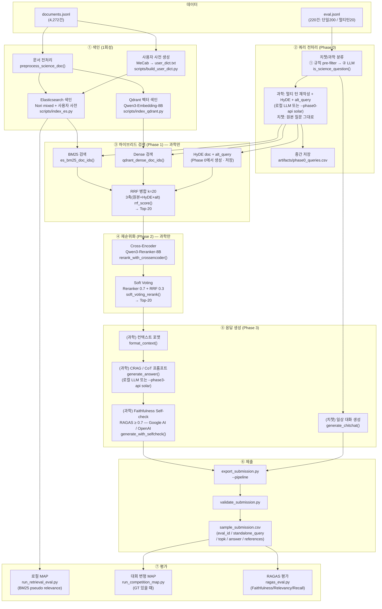

# IR 프로젝트 운영 가이드

프로젝트 루트(`IR/`)를 기준으로 작성했습니다.

---

## 전체 파이프라인 흐름



---

## 클래스 다이어그램

```mermaid
classDiagram
    %% ── 데이터 모델 ───────────────────────────────────────────────────────────
    class SubmissionRecord {
        <<dataclass>>
        +int eval_id
        +str standalone_query
        +list~str~ topk
        +str answer
        +list~str~ references
        +to_dict() dict
    }

    class _LLMComplete {
        <<Protocol>>
        +complete(prompt: str) CompletionResponse
    }

    %% ── 유틸리티 ──────────────────────────────────────────────────────────────
    class config {
        <<module>>
        +load_config(path) dict
        +validate_config(cfg, required) None
        +resolve_config_path(root, arg) Path
        +repo_root_from(start) Path
    }

    class io_util {
        <<module>>
        +iter_jsonl(path) Iterator~dict~
        +write_jsonl(path, rows) None
    }

    class preprocess {
        <<module>>
        +preprocess_science_doc(text) str
    }

    class vram {
        <<module>>
        +unload_model(model) None
    }

    class submission {
        <<module>>
        +validate_submission_row(row) None
    }

    %% ── Phase 0: 쿼리 전처리 ─────────────────────────────────────────────────
    class query_rewrite {
        <<module · Phase 0>>
        +is_science_question(msg, llm) bool
        +build_search_query(msg, llm) str
        +generate_alt_query(query, llm) str
        -_SCIENCE_PREFILTER_RE : Pattern
        -_is_valid_query(query, original) bool
        -_strip_think(text) str
    }

    class llm_openai_chat {
        <<module · API 브릿지>>
        +OpenAIChatCompletionLLM.complete(prompt) CompletionResponse
        -Solar Pro 등 OpenAI 호환 Chat Completions
    }

    %% ── Phase 1: 색인 / 하이브리드 검색 ──────────────────────────────────────
    class es_util {
        <<module · Phase 1>>
        +KOREAN_SYNONYMS : list~str~
        +ensure_index(es, index, recreate, user_dict_rules) None
        -_build_settings(user_dict_rules) dict
    }

    class embeddings {
        <<module · Phase 1>>
        +build_huggingface_embedding(cfg) HuggingFaceEmbedding
        +embedding_model_kwargs() dict
    }

    class retrieval {
        <<module · Phase 1>>
        +es_bm25_doc_ids(es, index, query, top_k) list~str~
        +qdrant_dense_doc_ids(client, collection, embed_fn, query, top_k) list~str~
        +rrf_score(rankings, k=20) dict
        +generate_hyde_doc(query, llm) str
        -es_bm25_top_score(es, index, query) float
    }

    %% ── Phase 2: 재순위화 ─────────────────────────────────────────────────────
    class reranker {
        <<module · Phase 2>>
        +load_reranker(model_name) AutoModel
        +rerank_with_crossencoder(model, tokenizer, query, doc_ids, doc_map, top_n) list~str~
        +soft_voting_rerank(rrf_scores, reranker_scores, w_reranker) dict
        -_minmax_normalize(values) ndarray
    }

    %% ── Phase 3: 응답 생성 ────────────────────────────────────────────────────
    class generator {
        <<module · Phase 3>>
        +format_context(doc_ids, doc_map, top_k) str
        +generate_answer(question, context, llm, use_crag) str
        +generate_chitchat(question, llm) str
        +generate_with_selfcheck(question, context, llm, threshold, max_retries) str
        -_build_ragas_llm() LangchainLLMWrapper
        -_eval_faithfulness(question, answer, context) float
    }

    %% ── 평가 ──────────────────────────────────────────────────────────────────
    class eval_map {
        <<module · 평가>>
        +build_relevance_bm25(eval_path, es_client, llm, top_k) dict
        +evaluate_map(relevance, results) float
    }

    class pseudo_label {
        <<module · 평가>>
        +build_relevance_pseudo(eval_path, doc_path, embed_model, llm, top_k) dict
    }

    class competition_metrics {
        <<module · 평가>>
        +calc_map(submission_rows, gt) float
        +load_gt_jsonl(path) dict
        +load_submission_rows(path) list
    }

    %% ── 외부 시스템 ───────────────────────────────────────────────────────────
    class Elasticsearch {
        <<external>>
        BM25 + Nori 형태소 분석
    }

    class Qdrant {
        <<external>>
        HNSW 벡터 검색
    }

    class GoogleAI {
        <<external>>
        gemini-2.0-flash
        text-embedding-004
    }

    class OpenAI {
        <<external>>
        RAGAS 기본 평가자
    }

    class RAGAS {
        <<external>>
        faithfulness
        answer_relevancy
        context_recall
    }

    %% ── 관계 ──────────────────────────────────────────────────────────────────
    submission "1" *-- "1" SubmissionRecord : contains

    query_rewrite ..> _LLMComplete        : uses (Protocol)
    llm_openai_chat ..> _LLMComplete      : solar API 브릿지
    retrieval      ..> _LLMComplete        : uses (HyDE)
    generator      ..> _LLMComplete        : uses

    es_util    ..> Elasticsearch : 인덱스 생성
    retrieval  ..> Elasticsearch : BM25 검색
    retrieval  ..> Qdrant        : Dense 검색
    retrieval  ..> query_rewrite : build_search_query (HyDE)

    reranker   ..> retrieval     : Top-100 입력
    vram       ..> embeddings    : Phase 1 종료 후 언로드
    vram       ..> reranker      : Phase 2 종료 후 언로드

    generator  ..> RAGAS         : faithfulness 평가
    RAGAS      ..> GoogleAI      : LLM 평가자 (우선)
    RAGAS      ..> OpenAI        : LLM 평가자 (대안)

    eval_map      ..> query_rewrite : build_search_query
    eval_map      ..> io_util       : iter_jsonl
    pseudo_label  ..> query_rewrite : build_search_query
    pseudo_label  ..> io_util       : iter_jsonl
    pseudo_label  ..> embeddings    : 유사도 계산
```



---

## 0. 사전 준비

| 항목          | 요건                                             |
| ------------- | ------------------------------------------------ |
| Python        | **3.10.x** (`.python-version` 참고)              |
| GPU           | NVIDIA + CUDA — 임베딩·Reranker·LLM 실행 시 필요 |
| Elasticsearch | 8.x 직접 설치 + Nori 플러그인 (아래 2절 참고)    |
| Qdrant        | 바이너리 직접 설치 (아래 2절 참고)               |
| MeCab         | 사용자 사전 자동 추출 시 (선택, Ubuntu 권장)     |

`.env` 파일 필수 항목:

```env
ES_USERNAME=elastic
ES_PASSWORD=<비밀번호>
ES_CA_CERT=/etc/elasticsearch/certs/http_ca.crt

# RAGAS Self-check용 API 키 — 둘 중 하나 설정 (GOOGLE_API_KEY 우선 사용)
# Google AI Studio (무료 티어 제공, gemini-2.0-flash 사용)
GOOGLE_API_KEY=AIza...
# OpenAI (GOOGLE_API_KEY 없을 때 사용)
OPENAI_API_KEY=sk-...
# 둘 다 없거나 Self-check를 완전히 끄려면:
# DISABLE_SELFCHECK=1

# Upstage Solar Pro — SFT 답변 생성(build_sft_data) · 제출 파이프라인 Phase0/3 API 모드
#   export_submission.py --phase0-api solar --phase3-api solar
SOLAR_API_KEY=up_...

HF_TOKEN=hf_...       # HuggingFace private 모델 접근 시 필요
```

---

## 1. 가상환경 / 패키지 설치

```bash
# RAG 코어 + SFT 학습용 가상환경
python3.10 -m venv .venv
source .venv/bin/activate

# PyTorch 선설치 (CUDA 버전에 맞게 — requirements-train.txt 상단 주석 참고)
# 예: CUDA 12.1
pip install torch==2.3.1 --index-url https://download.pytorch.org/whl/cu121

pip install -e .
pip install -r requirements-train.txt
```

> **vLLM** 은 PyTorch 버전 충돌로 **별도 가상환경** 필수:
>
> ```bash
> python3.10 -m venv .venv-vllm
> source .venv-vllm/bin/activate
> pip install -r requirements-vllm.txt
> ```

---

## 2. 검색 DB 설치 및 기동

### 2-1. Elasticsearch 8.x + Nori 플러그인

```bash
## APT 저장소 등록
#1. GPG 키 다운로드 및 저장
wget -qO - https://artifacts.elastic.co/GPG-KEY-elasticsearch | sudo gpg --dearmor -o /usr/share/keyrings/elasticsearch-keyring.gpg

#2. APT 저장소 리스트 등록
echo "deb [signed-by=/usr/share/keyrings/elasticsearch-keyring.gpg] https://artifacts.elastic.co/packages/8.x/apt stable main" | sudo tee /etc/apt/sources.list.d/elastic-8.x.list

#3. 업데이트 및 설치
sudo apt-get update && sudo apt-get install -y elasticsearch

## Nori 형태소 분석 플러그인
sudo /usr/share/elasticsearch/bin/elasticsearch-plugin install analysis-nori

## 서비스 시작 (재부팅 후 자동 시작 포함)
#1. 서비스 실행
sudo -u elasticsearch /usr/share/elasticsearch/bin/elasticsearch -d -p /tmp/elasticsearch.pid

#2. 서비스 종료
sudo kill $(cat /tmp/elasticsearch.pid)

#3. 상태확인
curl -sS --cacert /etc/elasticsearch/certs/http_ca.crt -u elastic:'비밀번호' https://172.17.123.119:9200

#4. ~/.bashrc 에 추가
alias es-start='sudo -u elasticsearch /usr/share/elasticsearch/bin/elasticsearch -d -p /tmp/elasticsearch.pid'
alias es-stop='sudo kill $(cat /tmp/elasticsearch.pid)'
alias es-status='curl -sS --cacert /etc/elasticsearch/certs/http_ca.crt -u elastic:'\''비밀번호'\'' https://172.17.123.119:9200'
```

보안 설정 없이 로컬 전용으로 쓰려면 `/etc/elasticsearch/elasticsearch.yml`에 추가:

```yaml
xpack.security.enabled: false
```

변경 후 `sudo systemctl restart elasticsearch`

### 2-2. Qdrant

```bash
# 최신 바이너리 다운로드 (x86_64 Linux)
curl -L https://github.com/qdrant/qdrant/releases/latest/download/qdrant-x86_64-unknown-linux-musl.tar.gz \
  | tar -xz
# 백그라운드 실행 (기본 포트 6333)
./qdrant &

# 서비스 종료
pkill qdrant

# 서비스 상태확인
ps aux | grep qdrant
```

재부팅 후에도 자동 시작하려면 systemd 서비스로 등록하거나 `nohup ./qdrant &`로 실행하세요.

| 서비스        | 기본 주소               |
| ------------- | ----------------------- |
| Elasticsearch | `http://localhost:9200` |
| Qdrant        | `http://localhost:6333` |

주소를 변경한 경우 `config/default.yaml`의 `elasticsearch.url` / `qdrant.url`을 맞추세요.

---

## 4. 문서 색인 (1회)

### 4-1. 희소 검색 (ES BM25 + Nori)

```bash
# 최초 색인
python scripts/index_es.py --config config/default.yaml

# 인덱스 설정 변경 후 재색인 (동의어 사전·분석기 변경 시 --recreate 필수)
python scripts/index_es.py --config config/default.yaml --recreate
```

> `--recreate` 없이 실행하면 기존 인덱스를 그대로 사용합니다(중복 색인 방지).  
> 분석기·동의어(`KOREAN_SYNONYMS`)·사용자 사전 변경 시 반드시 `--recreate`로 재생성하세요.

### 4-2. (선택) 사용자 사전 생성 — MeCab 필요

```bash
python scripts/build_user_dict.py --config config/default.yaml
# → artifacts/user_dict.txt 생성
# config/default.yaml 의 es_util.ensure_index(user_dict_path=...) 에 경로 전달 필요
```

### 4-3. 벡터 검색 (Qdrant) — GPU + 시간 필요

```bash
python scripts/index_qdrant.py --config config/default.yaml
# 기존 컬렉션 재생성: --force
python scripts/index_qdrant.py --config config/default.yaml --force
```

---

## 5. 로컬 품질 점검

### 5-1. ES 연결 스모크

```bash
python scripts/smoke_e2e.py --config config/default.yaml
```

### 5-1b. Elasticsearch + Qdrant 색인 점검

`documents.jsonl` 건수와 ES 인덱스·Qdrant 컬렉션의 문서(포인트) 수가 일치하는지, 샘플 검색이 되는지 확인합니다.

```bash
python scripts/verify_indices.py --config config/default.yaml
# Dense 벡터 검색까지 시험하려면 GPU 부하 있음:
# python scripts/verify_indices.py --config config/default.yaml --probe-dense
```

### 5-2. BM25 Pseudo MAP (상대 비교용)

```bash
python scripts/run_retrieval_eval.py --config config/default.yaml
```

> 로컬 MAP은 BM25 휴리스틱 relevance 기준이므로 대회 공식 점수와 다릅니다.

### 5-3. 대회 변형 MAP — GT 파일 있을 때

```bash
python scripts/run_competition_map.py \
  --submission artifacts/sample_submission.csv \
  --gt data/eval_gt.jsonl \
  --validate-keys
```

`eval_gt.jsonl` 형식: `{"eval_id": N, "relevant_docids": ["uuid", ...]}`

---

## 6. SFT 학습 (선택 — 별도 가상환경)

### 6-1. 학습 데이터 생성

```bash
# 기본: BM25 검색 + placeholder 답변
python scripts/build_sft_data.py --config config/default.yaml --output artifacts/sft_data.jsonl

# Phase 0 CSV 재활용: 치챗 제외 + standalone 쿼리 재사용 (LLM 재호출 없음)
# + 상대 점수 필터 70% + 최소 문서 3개 보증 (paraphrase 보충)
python scripts/build_sft_data.py \
    --phase0-csv     artifacts/phase0_queries.csv \
    --min-bm25-score 1.0 \
    --rel-score-ratio 0.7 \
    --min-docs       3 \
    --answer-api     solar --answer-model solar-pro
    # --answer-api openai                          # GPT-4o-mini
    # --answer-api google                          # Gemini-2.0-flash
```

주요 옵션:

| 옵션                | 기본값       | 설명                                                                 |
| ------------------- | ------------ | -------------------------------------------------------------------- |
| `--phase0-csv`      | 없음         | Phase 0 중간 저장 CSV. 지정 시 치챗 제외·standalone 재활용           |
| `--min-bm25-score`  | 1.0          | BM25 최소 점수. 미달 문서 제외, 전부 미달 시 top-1 유지              |
| `--rel-score-ratio` | 0.7          | top-1 점수 대비 유지 비율. 미달 문서는 노이즈로 제거. 0이면 비활성화 |
| `--min-docs`        | 3            | 컨텍스트 최소 문서 수. 필터 후 부족하면 paraphrase로 보충            |
| `--top-k`           | 5            | 검색할 최대 문서 수                                                  |
| `--answer-api`      | 없음         | `solar` / `openai` / `google` — 실제 답변 생성                       |
| `--answer-model`    | API별 기본값 | 모델 이름 직접 지정                                                  |

> `--answer-api` 없으면 `assistant` 필드에 `[TODO: 고품질 답변으로 교체하세요]` placeholder가 들어갑니다.
>
> **문서 품질 관리**: `--rel-score-ratio 0.7`은 top-1 점수의 70% 미만인 문서를 제거합니다.
> 제거 후 `--min-docs` 미만이면 Solar API로 paraphrase를 생성해 보충합니다.
> 생성된 답변은 `_clean_answer()`를 통해 LaTeX·마크다운 포맷이 제거된 자연어 텍스트로 정제됩니다.
>
> **`phase0_queries.csv` 주의**: 이 파일은 Phase 0 LLM 실행 시 생성됩니다.
> 치챗 오분류가 의심될 경우 `export_submission.py --pipeline`을 재실행하거나
> CSV를 직접 수정(`is_science` 컬럼을 `True`로 변경)한 뒤 재생성하세요.

### 6-2. Unsloth SFT 학습

> **모델**: `Qwen/Qwen3.5-4B`  
> Qwen3.5-9B는 GatedDeltaNet 하이브리드 아키텍처로 `flash-linear-attention`/`causal-conv1d`가 필요합니다. nvcc 없는 환경에서는 PyTorch fallback으로 OOM이 발생하므로 4B를 사용합니다.

```bash
# py310 환경에서

# QLoRA 4-bit
python scripts/train_sft.py --data artifacts/sft_data.jsonl

# bf16 LoRA (RTX 3090 24GB 동작 확인)
python scripts/train_sft.py --data artifacts/sft_data.jsonl --no-qlora
```

주요 학습 설정:

| 항목               | 값                      |
| ------------------ | ----------------------- |
| LoRA rank / alpha  | 8 / 16                  |
| batch size / accum | 1 / 16 (effective 16)   |
| max_seq_len        | 1024                    |
| 출력 포맷          | HuggingFace safetensors |

학습 완료 → `artifacts/qwen35-4b-science-rag/` 에 모델 저장

---

## 7. vLLM 서빙 (선택 — 별도 가상환경)

> **주의**: RTX 3090(24GB)에서 vLLM + Embedding 8B + Reranker 8B를 동시에 올릴 수 없습니다.  
> 실제 파이프라인은 **8절의 4-Phase 순차 로드 방식**을 사용하며 vLLM 없이 동작합니다.  
> vLLM은 API 서빙이 필요한 경우에만 사용하세요.

```bash
# py310-vllm 환경 생성 (최초 1회)
python3.10 -m venv .venv-vllm
source .venv-vllm/bin/activate
pip install -r requirements-vllm.txt
pip install "numpy<2"   # numpy 2.x 충돌 방지

# tokenizer_class 수정 (최초 1회 — 학습 후 필요)
python3 -c "
import json, pathlib
p = pathlib.Path('artifacts/qwen35-4b-science-rag/tokenizer_config.json')
d = json.loads(p.read_text())
d['tokenizer_class'] = 'Qwen2TokenizerFast'
p.write_text(json.dumps(d, indent=2, ensure_ascii=False))
"

# 서버 기동
python scripts/serve_vllm.py --model artifacts/qwen35-4b-science-rag
```

vLLM 사용 시 `config/default.yaml`의 `vllm` 섹션 주석 해제:

```yaml
vllm:
  url: "http://localhost:8000"
  model_name: "science-rag"
```

---

## 8. 제출 파일 생성

### 8-1. 형식 검증용 (더미)

```bash
python scripts/export_submission.py --placeholder --config config/default.yaml
# topk를 무작위 uuid로 채우려면:
python scripts/export_submission.py --placeholder --dummy-topk --config config/default.yaml
```

### 8-2. 실제 파이프라인 실행

ES + Qdrant 색인 완료 + GPU 환경에서 **py310** 가상환경으로 실행합니다.  
vLLM 서버는 **불필요** — 4-Phase 순차 로드로 24GB VRAM 내에서 동작합니다.

```bash
# config/default.yaml의 vllm 섹션이 주석 처리된 상태여야 합니다
python scripts/export_submission.py \
  --pipeline \
  --config config/default.yaml \
  --top-k-retrieve 20 \
  --top-k-rerank 10
```

**Phase 0·3을 Solar Pro API만 사용** (로컬 HuggingFace LLM 미로드 — `SOLAR_API_KEY` 필요, `requirements-train.txt`의 `openai` 패키지 사용):

```bash
python scripts/export_submission.py \
  --pipeline \
  --config config/default.yaml \
  --phase0-api solar \
  --phase3-api solar
```

| 옵션 | 기본값 | 설명 |
| --- | --- | --- |
| `--phase0-api` | `hf` | `hf` = `config`의 로컬 LLM · `solar` = Solar Pro (standalone·HyDE·alt_query·과학 판별) |
| `--phase3-api` | `hf` | `hf` = 로컬 LLM · `solar` = Solar Pro (`answer` 생성). `--llm-select` 문서 선별에도 동일 백엔드 적용 |
| `--phase0-cache` | 없음 | 지정 CSV로 Phase 0 생략 (`artifacts/phase0_queries.csv` 등). **3축 RRF**를 쓰려면 CSV에 `alt_query` 열이 채워진 최신 파일 사용 |
| `--llm-select` | 끔 | Phase 2.5 LLM 문서 선별 |
| `--multi-field` | 끔 | F-2 메타 색인 후 BM25 멀티필드 검색 |
| `--skip-dense` | 끔 | Dense 검색 생략(BM25만) |
| `--skip-generation` | 끔 | Phase 3 답변 생략(검색 실험용) |

**4-Phase 순차 로드 (VRAM 관리)**:

| Phase | 모델 / 백엔드 | 작업                                                                    | 대상   | VRAM / 비고 |
| ----- | ------------- | ----------------------------------------------------------------------- | ------ | ----- |
| 0     | 로컬 LLM 또는 **Solar API** | 치챗/과학 분류 + 쿼리 재작성 + HyDE + **alt_query** → `phase0_queries.csv` | 전체   | 로컬 시 ~8GB · API 시 GPU 없음 |
| 1     | Embedding 8B | BM25 + Dense → 3축 RRF(k=20) Top-20                                     | 과학만 | ~16GB |
| 2     | Reranker 8B  | Cross-Encoder + Soft Voting → Top-N                                     | 과학만 | ~16GB |
| 3     | 로컬 LLM 또는 **Solar API** | CRAG + Self-check (과학) / 일상 대화 (치챗)                             | 전체   | 로컬 시 ~8GB · API 시 GPU 없음 |

각 Phase 종료 후 모델을 GPU에서 언로드(`vram.unload_model`)하여 다음 Phase를 위한 VRAM을 확보합니다.

> **치챗 처리**: `eval.jsonl` 220건 중 약 20건이 과학 상식과 무관한 일상 대화입니다.  
> Phase 0에서 `is_science_question()`으로 분류 후, 치챗 샘플은 Phase 1·2 검색·리랭킹을 건너뛰고  
> Phase 3에서 `generate_chitchat()`으로 자연스러운 대화 응답을 생성합니다.

> **RAGAS Self-check**: `.env`의 `SOLAR_API_KEY`, `GOOGLE_API_KEY`(Google AI Studio) 또는 `OPENAI_API_KEY` 중 하나로 LLM 평가자를 구성합니다. `SOLAR_API_KEY`가 우선 사용됩니다.  
> 둘 다 없거나 비활성화하려면 `.env`에 `DISABLE_SELFCHECK=1`을 추가하면 첫 번째 생성 결과를 그대로 반환합니다.

### 8-3. 제출 파일 후처리

8-2에서 생성된 `sample_submission.csv`의 `answer` 필드를 정제합니다.

| 패턴                        | 처리               |
| --------------------------- | ------------------ |
| `<think>` 앞에 내용 있음    | 앞 내용만 사용     |
| `<think>`로 시작 (truncate) | Solar API로 재생성 |
| CRAG 대시 포맷 (`- 답변:`)  | 본문만 추출        |
| 이미 깨끗함                 | 그대로 유지        |

```bash
# 미리보기만 (저장 안 함)
python scripts/postprocess_submission.py \
    --input artifacts/sample_submission.csv \
    --dry-run

# 후처리 + Solar API 재생성
python scripts/postprocess_submission.py \
    --input  artifacts/sample_submission.csv \
    --output artifacts/sample_submission_clean.csv \
    --regen-api solar \
    --eval   data/eval.jsonl \
    --docs   data/documents.jsonl
```

### 8-4. 제출 파일 검증

```bash
python scripts/validate_submission.py artifacts/sample_submission_clean.csv
```

---

## 9. RAGAS 품질 평가

```bash
# 패키지 설치 (ragas, datasets, langchain-google-genai)
pip install ragas datasets "langchain-google-genai>=4.0.0"

python scripts/ragas_eval.py \
  --submission artifacts/sample_submission.csv \
  --eval data/eval.jsonl \
  --documents data/documents.jsonl
```

평가 LLM은 `.env`의 키 설정에 따라 자동 선택됩니다:

| 조건                  | 사용 LLM                                | 비고                 |
| --------------------- | --------------------------------------- | -------------------- |
| `GOOGLE_API_KEY` 설정 | **Gemini 2.0 Flash** (Google AI Studio) | 무료 티어, 우선 사용 |
| `OPENAI_API_KEY` 설정 | OpenAI 기본값                           | Google 키 없을 때    |
| 둘 다 미설정          | 오류 발생                               | 둘 중 하나 필수      |

```bash
# LangSmith 추적 활성화
LANGCHAIN_API_KEY=lsv2_... LANGCHAIN_TRACING_V2=true \
python scripts/ragas_eval.py --submission artifacts/sample_submission.csv ...
```

평가 지표: Faithfulness / Answer Relevancy / Context Recall

---

## 10. 단위 테스트

```bash
python -m pytest tests/ -v

# 커버리지 측정
python -m pytest tests/ --cov=ir_rag --cov-report=term-missing
```

| 테스트 파일                   | 커버 모듈                                                      |
| ----------------------------- | -------------------------------------------------------------- |
| `test_competition_metrics.py` | `competition_metrics.calc_map`                                 |
| `test_config.py`              | `config.validate_config`, `resolve_config_path`, `load_config` |
| `test_io_util.py`             | `io_util.iter_jsonl`, `write_jsonl`                            |
| `test_preprocess.py`          | `preprocess.preprocess_science_doc`                            |
| `test_query_rewrite.py`       | `query_rewrite.build_search_query`, `_is_valid_query`          |
| `test_submission.py`          | `submission.SubmissionRecord`, `validate_submission_row`       |

---

## 11. 설정 변경

[config/default.yaml](../config/default.yaml) 에서 조정:

| 섹션            | 주요 항목                                    |
| --------------- | -------------------------------------------- |
| `elasticsearch` | `url`, `index`                               |
| `qdrant`        | `url`, `collection`, `vector_size`           |
| `paths`         | `documents`, `eval`, `user_dict_out`         |
| `embedding`     | `model_name`, `trust_remote_code`            |
| `reranker`      | `model_name` (4B ↔ 8B 전환)                  |
| `vllm`          | `url`, `model_name` (서버 기동 후 주석 해제) |
| `llm`           | `model_name`, `checkpoint`, `max_new_tokens`   |
| (CLI)           | Phase 0·3 API 모드: `export_submission.py --phase0-api solar --phase3-api solar` — `.env`에 `SOLAR_API_KEY` |

---

## 12. 공식 베이스라인 (별도 흐름)

대회 제공 스크립트: [baseline_code/rag_with_elasticsearch.py](../baseline_code/rag_with_elasticsearch.py)

Elasticsearch 보안(TLS, 비밀번호) 및 OpenAI API 키는 `.env` 파일로 관리하세요 (`.env.example` 참고).

---

## 색인 이후 재작업 순서 (퀵 레퍼런스)

ES + Qdrant 색인이 완료된 상태에서 결과를 개선하거나 처음부터 재실행할 때의 순서입니다.

```
[ES + Qdrant 색인 완료] ──────────────────────────────────────────────────────┐
                                                                               │
  Step 1. 전체 파이프라인 실행                                                  │
  python scripts/export_submission.py --pipeline                               │
      # Phase 0·3 API: --phase0-api solar --phase3-api solar                  │
      → artifacts/phase0_queries.csv  (Phase 0 분류·재작성·HyDE·alt_query)     │
      → artifacts/sample_submission.csv  (최종 제출 파일 초안)                  │
                          │                                                    │
  Step 2. 제출 파일 후처리                                                      │
  python scripts/postprocess_submission.py                                     │
      --input  artifacts/sample_submission.csv                                 │
      --output artifacts/sample_submission_clean.csv                           │
      --regen-api solar                                                        │
      → artifacts/sample_submission_clean.csv  (제출용)                        │
                          │                                                    │
  Step 3. SFT 학습 데이터 생성                                                  │
  python scripts/build_sft_data.py                                             │
      --phase0-csv artifacts/phase0_queries.csv   ← Step 1 결과 재활용         │
      --rel-score-ratio 0.7 --min-docs 3                                       │
      --answer-api solar                                                       │
      → artifacts/sft_data.jsonl                                               │
                          │                                                    │
  Step 4. SFT 파인튜닝                                                          │
  python scripts/train_sft.py                                                  │
      --data artifacts/sft_data.jsonl                                          │
      → artifacts/qwen35-4b-science-rag/                                       │
                          │                                                    │
  Step 5. 파인튜닝 모델로 재추론 (Step 1 반복)                                   │
  config/default.yaml 의 llm.model_name 을 파인튜닝 경로로 변경 후             │
  python scripts/export_submission.py --pipeline                               │
└──────────────────────────────────────────────────────────────────────────────┘
```

**주의 사항**

- Step 1 실행 전 ES(`su -s /bin/bash elasticsearch -c ".../elasticsearch -d"`)와 Qdrant(`./qdrant &`)가 기동 중이어야 합니다.
- `phase0_queries.csv`에 오분류(치챗으로 잘못 분류된 과학 질문)가 있으면 `is_science` 컬럼을 `True`로 수정한 뒤 Step 3부터 재실행하면 됩니다. Step 1 전체 재실행 없이 SFT 데이터만 빠르게 수정할 수 있습니다.
- Step 2·3은 서로 독립적이므로 병렬 진행 가능합니다.

---

## 참고 문서

| 문서                                                          | 내용                              |
| ------------------------------------------------------------- | --------------------------------- |
| [docs/RAG_Pipeline_Tech_Stack.md](RAG_Pipeline_Tech_Stack.md) | 기술 스택 · 설계 · 모델 선택 근거 |
| [README.md](../README.md)                                     | 프로젝트 개요 · 비개발자용 순서   |
