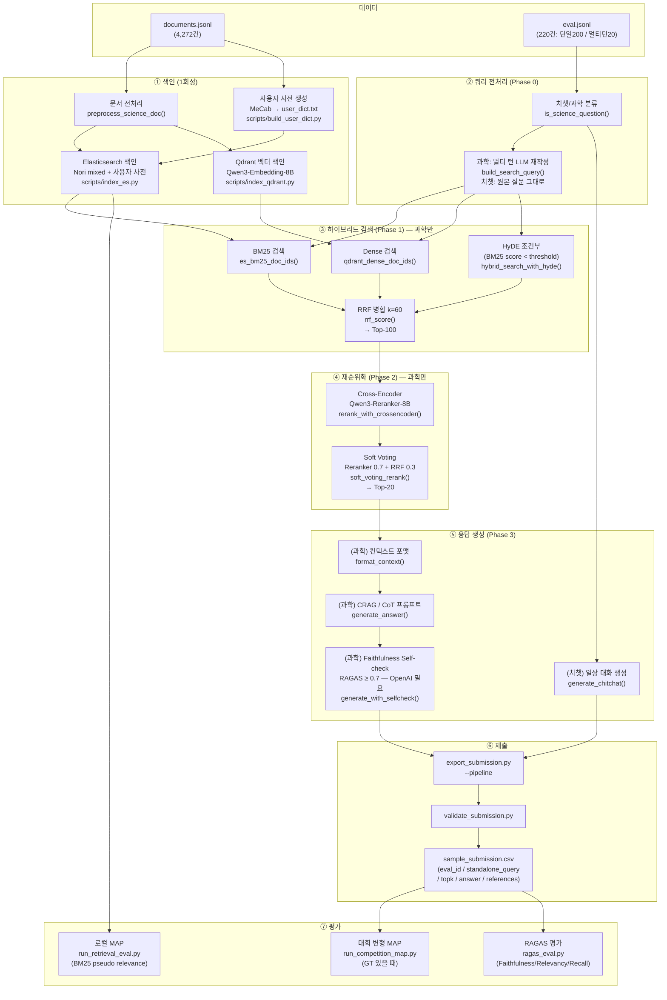

# IR 프로젝트 운영 가이드

프로젝트 루트(`IR/`)를 기준으로 작성했습니다.

---

## 전체 파이프라인 흐름



---

## 0. 사전 준비

| 항목          | 요건                                             |
| ------------- | ------------------------------------------------ |
| Python        | **3.10.x** (`.python-version` 참고)              |
| GPU           | NVIDIA + CUDA — 임베딩·Reranker·LLM 실행 시 필요 |
| Elasticsearch | 8.x 직접 설치 + Nori 플러그인 (아래 2절 참고)    |
| Qdrant        | 바이너리 직접 설치 (아래 2절 참고)               |
| MeCab         | 사용자 사전 자동 추출 시 (선택, Ubuntu 권장)     |

`.env` 파일 필수 항목:

```env
ES_USERNAME=elastic
ES_PASSWORD=<비밀번호>
ES_CA_CERT=/etc/elasticsearch/certs/http_ca.crt

# OpenAI — RAGAS Self-check 사용 시 필요. 쿼터 초과 시 아래 항목 추가
OPENAI_API_KEY=sk-...
DISABLE_SELFCHECK=1   # Self-check 비활성화 (OpenAI 쿼터 초과 시)

HF_TOKEN=hf_...       # HuggingFace private 모델 접근 시 필요
```

---

## 1. 가상환경 / 패키지 설치

```bash
# RAG 코어 + SFT 학습용 가상환경
python3.10 -m venv .venv
source .venv/bin/activate

# PyTorch 선설치 (CUDA 버전에 맞게 — requirements-train.txt 상단 주석 참고)
# 예: CUDA 12.1
pip install torch==2.3.1 --index-url https://download.pytorch.org/whl/cu121

pip install -e .
pip install -r requirements-train.txt
```

> **vLLM** 은 PyTorch 버전 충돌로 **별도 가상환경** 필수:
>
> ```bash
> python3.10 -m venv .venv-vllm
> source .venv-vllm/bin/activate
> pip install -r requirements-vllm.txt
> ```

---

## 2. 검색 DB 설치 및 기동

### 2-1. Elasticsearch 8.x + Nori 플러그인

```bash
## APT 저장소 등록
#1. GPG 키 다운로드 및 저장
wget -qO - https://artifacts.elastic.co/GPG-KEY-elasticsearch | sudo gpg --dearmor -o /usr/share/keyrings/elasticsearch-keyring.gpg

#2. APT 저장소 리스트 등록
echo "deb [signed-by=/usr/share/keyrings/elasticsearch-keyring.gpg] https://artifacts.elastic.co/packages/8.x/apt stable main" | sudo tee /etc/apt/sources.list.d/elastic-8.x.list

#3. 업데이트 및 설치
sudo apt-get update && sudo apt-get install -y elasticsearch

## Nori 형태소 분석 플러그인
sudo /usr/share/elasticsearch/bin/elasticsearch-plugin install analysis-nori

## 서비스 시작 (재부팅 후 자동 시작 포함)
#1. 서비스 실행
sudo -u elasticsearch /usr/share/elasticsearch/bin/elasticsearch -d -p /tmp/elasticsearch.pid

#2. 서비스 종료
sudo kill $(cat /tmp/elasticsearch.pid)

#3. 상태확인
curl -sS --cacert /etc/elasticsearch/certs/http_ca.crt -u elastic:'비밀번호' https://172.17.123.119:9200

#4. ~/.bashrc 에 추가
alias es-start='sudo -u elasticsearch /usr/share/elasticsearch/bin/elasticsearch -d -p /tmp/elasticsearch.pid'
alias es-stop='sudo kill $(cat /tmp/elasticsearch.pid)'
alias es-status='curl -sS --cacert /etc/elasticsearch/certs/http_ca.crt -u elastic:'\''비밀번호'\'' https://172.17.123.119:9200'
```

보안 설정 없이 로컬 전용으로 쓰려면 `/etc/elasticsearch/elasticsearch.yml`에 추가:

```yaml
xpack.security.enabled: false
```

변경 후 `sudo systemctl restart elasticsearch`

### 2-2. Qdrant

```bash
# 최신 바이너리 다운로드 (x86_64 Linux)
curl -L https://github.com/qdrant/qdrant/releases/latest/download/qdrant-x86_64-unknown-linux-musl.tar.gz \
  | tar -xz
# 백그라운드 실행 (기본 포트 6333)
./qdrant &

# 서비스 종료
pkill qdrant

# 서비스 상태확인
ps aux | grep qdrant
```

재부팅 후에도 자동 시작하려면 systemd 서비스로 등록하거나 `nohup ./qdrant &`로 실행하세요.

| 서비스        | 기본 주소               |
| ------------- | ----------------------- |
| Elasticsearch | `http://localhost:9200` |
| Qdrant        | `http://localhost:6333` |

주소를 변경한 경우 `config/default.yaml`의 `elasticsearch.url` / `qdrant.url`을 맞추세요.

---

## 4. 문서 색인 (1회)

### 4-1. 희소 검색 (ES BM25 + Nori)

```bash
python scripts/index_es.py --config config/default.yaml
```

### 4-2. (선택) 사용자 사전 생성 — MeCab 필요

```bash
python scripts/build_user_dict.py --config config/default.yaml
# → artifacts/user_dict.txt 생성
# config/default.yaml 의 es_util.ensure_index(user_dict_path=...) 에 경로 전달 필요
```

### 4-3. 벡터 검색 (Qdrant) — GPU + 시간 필요

```bash
python scripts/index_qdrant.py --config config/default.yaml
# 기존 컬렉션 재생성: --force
python scripts/index_qdrant.py --config config/default.yaml --force
```

---

## 5. 로컬 품질 점검

### 5-1. ES 연결 스모크

```bash
python scripts/smoke_e2e.py --config config/default.yaml
```

### 5-2. BM25 Pseudo MAP (상대 비교용)

```bash
python scripts/run_retrieval_eval.py --config config/default.yaml
```

> 로컬 MAP은 BM25 휴리스틱 relevance 기준이므로 대회 공식 점수와 다릅니다.

### 5-3. 대회 변형 MAP — GT 파일 있을 때

```bash
python scripts/run_competition_map.py \
  --submission artifacts/sample_submission.csv \
  --gt data/eval_gt.jsonl \
  --validate-keys
```

`eval_gt.jsonl` 형식: `{"eval_id": N, "relevant_docids": ["uuid", ...]}`

---

## 6. SFT 학습 (선택 — 별도 가상환경)

### 6-1. 학습 데이터 생성

```bash
python scripts/build_sft_data.py --config config/default.yaml --output artifacts/sft_data.jsonl
```

생성 후 `artifacts/sft_data.jsonl`의 `assistant` 답변을 **고품질 데이터로 교체**하여 학습 효과를 높이세요.

### 6-2. Unsloth SFT 학습

> **모델**: `Qwen/Qwen3.5-4B`  
> Qwen3.5-9B는 GatedDeltaNet 하이브리드 아키텍처로 `flash-linear-attention`/`causal-conv1d`가 필요합니다. nvcc 없는 환경에서는 PyTorch fallback으로 OOM이 발생하므로 4B를 사용합니다.

```bash
# py310 환경에서

# QLoRA 4-bit
python scripts/train_sft.py --data artifacts/sft_data.jsonl

# bf16 LoRA (RTX 3090 24GB 동작 확인)
python scripts/train_sft.py --data artifacts/sft_data.jsonl --no-qlora
```

주요 학습 설정:

| 항목 | 값 |
|---|---|
| LoRA rank / alpha | 8 / 16 |
| batch size / accum | 1 / 16 (effective 16) |
| max_seq_len | 1024 |
| 출력 포맷 | HuggingFace safetensors |

학습 완료 → `artifacts/qwen35-4b-science-rag/` 에 모델 저장

---

## 7. vLLM 서빙 (선택 — 별도 가상환경)

> **주의**: RTX 3090(24GB)에서 vLLM + Embedding 8B + Reranker 8B를 동시에 올릴 수 없습니다.  
> 실제 파이프라인은 **8절의 4-Phase 순차 로드 방식**을 사용하며 vLLM 없이 동작합니다.  
> vLLM은 API 서빙이 필요한 경우에만 사용하세요.

```bash
# py310-vllm 환경 생성 (최초 1회)
python3.10 -m venv .venv-vllm
source .venv-vllm/bin/activate
pip install -r requirements-vllm.txt
pip install "numpy<2"   # numpy 2.x 충돌 방지

# tokenizer_class 수정 (최초 1회 — 학습 후 필요)
python3 -c "
import json, pathlib
p = pathlib.Path('artifacts/qwen35-4b-science-rag/tokenizer_config.json')
d = json.loads(p.read_text())
d['tokenizer_class'] = 'Qwen2TokenizerFast'
p.write_text(json.dumps(d, indent=2, ensure_ascii=False))
"

# 서버 기동
python scripts/serve_vllm.py --model artifacts/qwen35-4b-science-rag
```

vLLM 사용 시 `config/default.yaml`의 `vllm` 섹션 주석 해제:

```yaml
vllm:
  url: "http://localhost:8000"
  model_name: "science-rag"
```

---

## 8. 제출 파일 생성

### 8-1. 형식 검증용 (더미)

```bash
python scripts/export_submission.py --placeholder --config config/default.yaml
# topk를 무작위 uuid로 채우려면:
python scripts/export_submission.py --placeholder --dummy-topk --config config/default.yaml
```

### 8-2. 실제 파이프라인 실행

ES + Qdrant 색인 완료 + GPU 환경에서 **py310** 가상환경으로 실행합니다.  
vLLM 서버는 **불필요** — 4-Phase 순차 로드로 24GB VRAM 내에서 동작합니다.

```bash
# config/default.yaml의 vllm 섹션이 주석 처리된 상태여야 합니다
python scripts/export_submission.py \
  --pipeline \
  --config config/default.yaml \
  --top-k-retrieve 20 \
  --top-k-rerank 10
```

**4-Phase 순차 로드 (VRAM 관리)**:

| Phase | 모델 | 작업 | 대상 | VRAM |
|---|---|---|---|---|
| 0 | LLM 4B | 치챗/과학 분류 + 멀티턴 쿼리 재작성 | 전체 | ~8GB |
| 1 | Embedding 8B | BM25 + Dense → RRF Top-100 | 과학만 | ~16GB |
| 2 | Reranker 8B | Cross-Encoder + Soft Voting → Top-N | 과학만 | ~16GB |
| 3 | LLM 4B | CRAG + Self-check (과학) / 일상 대화 (치챗) | 전체 | ~8GB |

각 Phase 종료 후 모델을 GPU에서 언로드(`vram.unload_model`)하여 다음 Phase를 위한 VRAM을 확보합니다.

> **치챗 처리**: `eval.jsonl` 220건 중 약 20건이 과학 상식과 무관한 일상 대화입니다.  
> Phase 0에서 `is_science_question()`으로 분류 후, 치챗 샘플은 Phase 1·2 검색·리랭킹을 건너뛰고  
> Phase 3에서 `generate_chitchat()`으로 자연스러운 대화 응답을 생성합니다.

> **RAGAS Self-check**: OpenAI API를 LLM 평가자로 사용합니다.  
> 쿼터 초과 시 `.env`에 `DISABLE_SELFCHECK=1`을 추가하면 Self-check를 건너뛰고 첫 번째 생성 결과를 그대로 사용합니다.

### 8-3. 제출 파일 검증

```bash
python scripts/validate_submission.py artifacts/sample_submission.csv
```

---

## 9. RAGAS 품질 평가

```bash
pip install ragas datasets   # 별도 설치

python scripts/ragas_eval.py \
  --submission artifacts/sample_submission.csv \
  --eval data/eval.jsonl \
  --documents data/documents.jsonl

# LangSmith 추적 활성화
LANGCHAIN_API_KEY=lsv2_... LANGCHAIN_TRACING_V2=true \
python scripts/ragas_eval.py --submission artifacts/sample_submission.csv ...
```

평가 지표: Faithfulness / Answer Relevancy / Context Recall

---

## 10. 단위 테스트

```bash
python -m pytest tests/ -v

# 커버리지 측정
python -m pytest tests/ --cov=ir_rag --cov-report=term-missing
```

| 테스트 파일                   | 커버 모듈                                                      |
| ----------------------------- | -------------------------------------------------------------- |
| `test_competition_metrics.py` | `competition_metrics.calc_map`                                 |
| `test_config.py`              | `config.validate_config`, `resolve_config_path`, `load_config` |
| `test_io_util.py`             | `io_util.iter_jsonl`, `write_jsonl`                            |
| `test_preprocess.py`          | `preprocess.preprocess_science_doc`                            |
| `test_query_rewrite.py`       | `query_rewrite.build_search_query`, `_is_valid_query`          |
| `test_submission.py`          | `submission.SubmissionRecord`, `validate_submission_row`       |

---

## 11. 설정 변경

[config/default.yaml](../config/default.yaml) 에서 조정:

| 섹션            | 주요 항목                                    |
| --------------- | -------------------------------------------- |
| `elasticsearch` | `url`, `index`                               |
| `qdrant`        | `url`, `collection`, `vector_size`           |
| `paths`         | `documents`, `eval`, `user_dict_out`         |
| `embedding`     | `model_name`, `trust_remote_code`            |
| `reranker`      | `model_name` (4B ↔ 8B 전환)                  |
| `vllm`          | `url`, `model_name` (서버 기동 후 주석 해제) |
| `llm`           | `model_name`, `max_new_tokens`               |

---

## 12. 공식 베이스라인 (별도 흐름)

대회 제공 스크립트: [baseline_code/rag_with_elasticsearch.py](../baseline_code/rag_with_elasticsearch.py)

Elasticsearch 보안(TLS, 비밀번호) 및 OpenAI API 키는 `.env` 파일로 관리하세요 (`.env.example` 참고).

---

## 참고 문서

| 문서                                                                  | 내용                              |
| --------------------------------------------------------------------- | --------------------------------- |
| [docs/RAG_Pipeline_Tech_Stack.md](RAG_Pipeline_Tech_Stack.md)         | 기술 스택 · 설계 · 모델 선택 근거 |
| [docs/03-analysis/ir_rag.analysis.md](03-analysis/ir_rag.analysis.md) | 설계-구현 Gap 분석 결과           |
| [README.md](../README.md)                                             | 프로젝트 개요 · 비개발자용 순서   |
