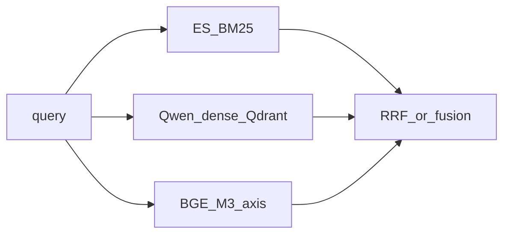

# PLAN_UP Stage 2 — 검색 개선 계획 (핵심)

> [`PLAN_UP.md`](PLAN_UP.md) 후속 단계. **§1.1 회귀 모니터링**, **§2.1 ES 동의어**, **§2.2 쿼리 재생성 프롬프트**, **§3 BGE-M3 multi-vector 검토**만 다룬다.

---

## 실행 TODO (체크리스트)

| ID | 내용 |
|----|------|
| `regression-monitoring` | §1.1 — baseline·MAP·inspection2 회귀 절차 운영 |
| `es-synonyms` | §2.1 — 질의 시드 + documents.jsonl 근거 동의어 사전·재색인 |
| `prompt-rewrite` | §2.2 — query_rewrite / HyDE / alt / Phase2.5 프롬프트 조정 및 회귀 |
| `bge-m3-multivec-review` | §3 — BGE-M3 multi-vector 축 설계·RRF 가중·재색인·부하 검토 후 프로토타입 여부 결정 |

---

## 1.1 회귀 모니터링 (상세)

**목적:** 파이프라인·코드·설정을 바꾼 뒤에도 **이전에 잡아 둔 “좋은” 수준(MAP, 리더보드, 알려진 실패 세트)**이 **악화되지 않았는지**를 반복적으로 확인한다. 특히 [`artifacts/inspection2.csv`](../artifacts/inspection2.csv)는 **잘못 검색된 사례 모음**이므로, 같은 질의에 대해 **다시 나쁜 문서가 상위로 올라오면 회귀(regression)** 로 본다.

### 무엇을 “기준선(baseline)”으로 남길지

1. **설정 스냅샷**  
   - 사용한 [`config/default.yaml`](../config/default.yaml) (또는 실험용 yaml) **전체 복사**를 `artifacts/baselines/YYYYMMDD_optimal.yaml` 등으로 보관하거나, **Git 커밋 해시 + 브랜치명**을 기록한다.  
   - [`scripts/export_submission.py`](../scripts/export_submission.py) 실행 시 넘긴 **CLI 인자 전체**를 한 줄로 텍스트 파일에 저장한다 (예: `artifacts/baselines/run_cmd_YYYYMMDD.txt`).

2. **산출물 스냅샷**  
   - 동일 설정으로 만든 **제출 CSV/JSONL**을 baseline 이름을 붙여 보관한다.  
   - 리더보드·사내 평가 **점수**를 `scores_optimal_YYYYMMDD.json` 또는 `README.txt`에 적는다.

3. **회귀용 “골든” 질의 집합**  
   - **좁은 세트:** `inspection2.csv`의 **`eval_id` 전부**.  
   - **넓은 세트:** [`data/eval.jsonl`](../data/eval.jsonl) **전체(220건)**.

### 어떤 지표를 볼지

| 지표 | 설명 | 참고 |
|------|------|------|
| 경쟁/리더보드 MAP | 대회 규칙 점수 | [`scripts/run_competition_map.py`](../scripts/run_competition_map.py) |
| 오프라인 MAP (의사 관련) | BM25 pseudo relevance | [`scripts/run_retrieval_eval.py`](../scripts/run_retrieval_eval.py) |
| inspection2 전용 | baseline vs 새 제출의 top3에 **문제 `docid`** 가 남는지 | 아래 워크플로 |

의사 관련 MAP은 **절대값**보다 **동일 조건 전후 Δ**가 중요하다.

### 권장 워크플로 (매번 동일)

1. **변경 전:** baseline 명령·산출물 확인.  
2. **변경 후:** 동일 데이터·동일 인덱스(ES/Qdrant)·동일 시드로 제출 재생성.  
3. **전역:** `run_retrieval_eval.py` 등으로 **MAP Δ** 기록. 팀 기준(예: MAP 하락 허용 한도) 적용.  
4. **inspection2:** 각 `eval_id`에서 **새 topk에 과거 문제 `docid`가 포함되는지** 집계.  
5. **기록:** 날짜·변경 요약·MAP Δ·악화 건수·통과/실패.

### 자동화·CI (선택)

- 입력: baseline 제출, 새 제출, `inspection2`의 `eval_id`+문제 `docid`.  
- 출력 예: `regression_inspection2.json` — `bad_doc_still_in_top3` 등.  
- 전체 파이프라인은 무거우면 **inspection2 eval만** 경량 잡 또는 **야간 배치**.

### 요약 한 줄

**회귀 모니터링 = baseline 고정 + 전역 MAP Δ + inspection2 나쁜 docid 추적**을 **유의미한 변경마다** 반복한다.

---

## 실험 결과 요약

| 단계 | 내용 | 리더보드 MAP |
|------|------|-------------|
| §2.1 | ES 동의어 강화 적용 | **0.9008** |
| §2.2 | 쿼리 재생성 프롬프트 전체 반영 (§2.1 포함) | **0.9144** |

> 범위: 0.9 ~ 0.914 사이. §2.2 전체 반영 시 최고점 달성.

---

## 2.1 동의어 셋 (Elasticsearch) 강화

**역할:** BM25는 **같은 글자·토큰**으로 맞아야 점수가 오른다. **한글·영문 이표기·약어** 차이는 **동의어 규칙**으로 완화할 수 있다.

**레포 위치**

- [`src/ir_rag/es_util.py`](../src/ir_rag/es_util.py) — `KOREAN_SYNONYMS`, 검색 분석기 `korean_synonyms`.  
- [`scripts/build_synonyms.py`](../scripts/build_synonyms.py) — ES 형식 줄 생성 (입력은 메타 등 기존 방식 가능).  
- [`scripts/index_es.py`](../scripts/index_es.py) — `--synonyms`, 변경 후 **`--recreate` 재색인** ([`OPERATION.md`](OPERATION.md)).

**강화 절차(개념)**

1. 실패·오답 분석에서 “질문 용어 ↔ 지문 용어”가 **표기만 다른** 쌍을 수집.  
2. ES 형식 `a, b, c` 또는 `a => b`로 추가. 자동 생성 쌍은 **반드시 검토**.  
3. **§1.1**로 MAP·inspection2 악화 없는지 확인.

**한계:** **주제가 다른 오류**·**엔티티 혼동**은 동의어만으로 해결 어렵다.

### 질의 시드 + [`data/documents.jsonl`](../data/documents.jsonl)에서 근거 잡기

- **시드:** `inspection2` 등에서 **어떤 키워드를 보강할지**만 질의에서 뽑는다.  
- **동의어 후보:** [`data/documents.jsonl`](../data/documents.jsonl)에서만 증거를 찾는다 (공출현·스니펫·한글↔영문 동시 출현 등).  
- **금지:** [`artifacts/inspection2.csv`](../artifacts/inspection2.csv)의 **오답 본문**을 질의와 직접 묶어 동의어를 만들지 않는다 (잡음 고착 위험).  
- 적용 파일에 합친 뒤 재색인·**§1.1 회귀**.

---

## 2.2 쿼리 재생성 프롬프트 강화

Phase0에서 만들어지는 문자열(standalone / HyDE / alt / 과학 판별 / Phase 2.5 선별)의 **프롬프트·few-shot**을 조정한다.

| 구분 | 위치 | 강화 예시 |
|------|------|-----------|
| 멀티턴 → standalone | [`query_rewrite.py`](../src/ir_rag/query_rewrite.py) `build_search_query`, `FEW_SHOT_EXAMPLES` | 후속 질문에서 **지시 대상 유지** 예시 추가, 핵심 용어·형식 제약 명시 |
| 과학 질문 여부 | `is_science_question`, `_SCIENCE_FEW_SHOT` | 경계 오판 사례를 few-shot에 반영 |
| HyDE | [`retrieval.py`](../src/ir_rag/retrieval.py) `generate_hyde_doc` | 질문에 없는 개체 지양, 고유명사·수치 유지 |
| alt_query | `generate_alt_query` | 패러프레이즈하되 **핵심 엔티티 불변** |
| Phase 2.5 문서 선별 | [`export_submission.py`](../scripts/export_submission.py) `_llm_select_docs` | 주제·엔티티 일치 문구를 선별 기준에 명시 |

**주의:** 지연·비용·과적합 가능성. 변경 후 **§1.1** 필수.

---

## 3. BGE-M3 임베딩·multi-vector 검색 검토 (BM25 + Dense(Qwen) + multi-vector)

**목표:** 현재 축인 **Elasticsearch BM25** + **Qdrant 등에 올린 Qwen 계열 밀집 벡터(Dense)** 에 더해, **BGE-M3**로 얻은 **추가 검색 축**(multi-vector 또는 M3의 다른 출력)을 넣어 **후보 다양성·의미 매칭**을 보강하는 방안을 검토한다. (모델명·버전은 실험 시 [`config/default.yaml`](../config/default.yaml)과 맞출 것.)

### BGE-M3가 주는 것 (검토 시 전제)

- **Dense:** 질의·문서를 고정 차원 벡터로 — 기존 Qwen 임베딩과 **서로 다른 표현**을 제공해 RRF에 **제3의 의미 축**으로 쓸 수 있다.  
- **Sparse(lexical weights):** BM25와 겹치지만 **학습된 희소 가중**이라 **보조 축**으로 넣을지 비교 실험 가치가 있다.  
- **Multi-vector (ColBERT 스타일):** 문서를 **토큰/청크 단위 여러 벡터**로 저장해 **후반 매칭**이 세밀해질 수 있으나 **저장·검색 비용**이 커진다.

### 파이프라인에 넣는 그림 (개념)

- 최종적으로는 기존처럼 **Cross-Encoder 리랭커·soft voting** 단계로 이어질 수 있다(리랭커 입력 쿼리 문자열은 기존 정책 유지 여부 별도 결정).

### 구현 시 검토 항목

1. **인덱싱:** 문서마다 Qwen 벡터는 이미 있다면, **BGE-M3용 별도 컬렉션/네임드 벡터** 또는 호환 스토어에 **추가 색인**이 필요하다. multi-vector면 **Qdrant multivector** 지원 버전·스키마 확인.  
2. **질의 인코딩:** 질의를 BGE-M3로 인코딩하는 경로(배치·GPU)와 **지연**.  
3. **융합:** **RRF**로 3축(또는 sparse 포함 4축) 병합 시 **`--rrf-weights` 차원 확장**·축 순서 정의. HyDE/alt 축과 **중복·노이즈** 여부 점검.  
4. **비용:** VRAM·디스크·재색인 시간·쿼리당 지연. **§1.1**로 이득 대비 회귀 없는지 확인.  
5. **최소 실험:** 먼저 **BGE-M3 dense만** 제3 축으로 넣어 MAP·inspection2를 보고, 이득이 있을 때만 **multi-vector·sparse**로 확장하는 단계적 접근을 권장.

### 요약

- **의미:** “BM25 + Qwen Dense + BGE-M3(또는 M3 multi-vector)”는 **서로 다른 인코더 관점**을 RRF로 섞어 **한 축이 놓치는 정답**을 다른 축이 잡게 할 수 있다.  
- **리스크:** 운영 복잡도·지연·저장. 반드시 **§1.1 회귀**와 오프라인 MAP으로 검증.

---

## 참고 파일

- ES: [`src/ir_rag/es_util.py`](../src/ir_rag/es_util.py), [`scripts/index_es.py`](../scripts/index_es.py)  
- 쿼리: [`src/ir_rag/query_rewrite.py`](../src/ir_rag/query_rewrite.py), [`src/ir_rag/retrieval.py`](../src/ir_rag/retrieval.py)  
- 제출: [`scripts/export_submission.py`](../scripts/export_submission.py)  
- 설정: [`config/default.yaml`](../config/default.yaml)
