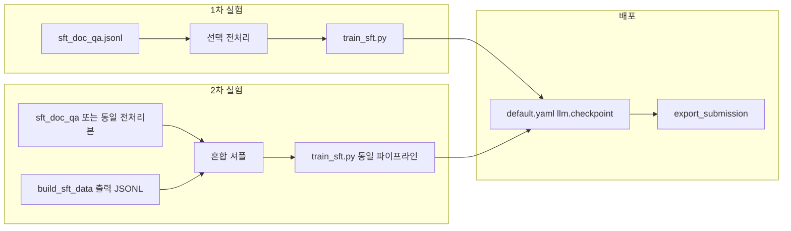

# 로컬 LLM (Qwen3.5-4B) SFT 계획

이 문서는 **파이프라인에서 쓰는 로컬 LLM**을 `sft_doc_qa`와 `build_sft_data` 산출물로 **단계적으로 학습(SFT)** 하고, 설정에 연결하는 흐름을 정리합니다.

**한 줄 요약**

1. **1차**: 문서 기반 QA 데이터(`sft_doc_qa`)만으로 먼저 학습해 **기준 모델(베이스라인)** 을 만든다.
2. **2차**: `build_sft_data.py`로 만든 **eval에 가까운 대화형 RAG 데이터**와 `sft_doc_qa`를 **섞어서** 다시 학습해, Phase 0·3에 더 맞는 분포를 넓힌다.
3. 학습이 끝나면 `config/default.yaml`의 `llm.checkpoint`에 결과 폴더를 지정해 **제출 스크립트**에서 로드한다.

**알아두면 좋은 점**

- Phase 0(쿼리 재작성·과학 여부 등)은 코드에서 **짧은 프롬프트 한 번에 답**을 요구하는 방식이고, 학습 데이터는 주로 **채팅 + 긴 참고 문서** 형태라서 **완전히 같은 과제는 아닙니다**. 그래도 과학 한국어·지시 따르기·문서 근거 습관은 전체 파이프라인에 도움이 될 수 있습니다.
- 자세한 파이프라인 단계는 [OPERATION.md](OPERATION.md)를 보세요.

---

## 전제와 데이터 형식

- [artifacts/sft_doc_qa.jsonl](../artifacts/sft_doc_qa.jsonl) 과 [scripts/build_sft_data.py](../scripts/build_sft_data.py) 산출물(예: [artifacts/sft_data_final.jsonl](../artifacts/sft_data_final.jsonl))은 모두 **`{"messages": [...]}`** 한 줄 한 레코드(JSONL)이며, [scripts/train_sft.py](../scripts/train_sft.py)의 `iter_jsonl` → `apply_chat_template`와 호환됩니다.
- **build_sft_data**는 `eval.jsonl` + 검색 + (선택) **Phase 0 CSV**로 **과학 대화만·standalone 쿼리**를 반영할 수 있고, 시스템 프롬프트는 과학 RAG 답변용(`scripts/build_sft_data.py`의 `_SYSTEM_PROMPT`)으로 **실제 eval 분포에 더 가깝습니다**.



---

## 1차 실험: sft_doc_qa 단독 (베이스라인)

**목표**: 긴 문서 컨텍스트를 학습에 제대로 넣고, 출처를 하나로 두어 **재현 가능한 기준 체크포인트**를 만든다. ([PLAN_UP.md](PLAN_UP.md)의 C-1 오염 데이터 실패 사례를 피하기 위함.)

**시퀀스 길이**

- `train_sft.py` 기본 `max-seq-len` 1024는 문서가 많이 붙은 샘플을 잘라 버릴 수 있어 **`--max-seq-len 4096`** 사용을 권장합니다([config/default.yaml](../config/default.yaml)의 `llm.context_window` 4096과 맞춤).
- 또는 **문서 블록당 최대 글자 수** 등으로 JSONL을 줄이는 전처리 스크립트(예: `scripts/preprocess_sft_messages.py` 수준)를 선택적으로 둘 수 있습니다.

**학습 예시 (bf16 LoRA)**

의존성은 프로젝트 안내에 따라 `requirements-train.txt` 등을 설치한 뒤 실행합니다.

```bash
python scripts/train_sft.py \
  --data artifacts/sft_doc_qa.jsonl \
  --model Qwen/Qwen3.5-4B \
  --output-dir artifacts/qwen35-4b-rag-sft \
  --no-qlora \
  --max-seq-len 4096 \
  --epochs 3 \
  --lr 2e-4
```

- VRAM이 빠듯하면 먼저 **QLoRA**(스크립트 기본)로 길이·배치를 검증한 뒤 bf16을 시도합니다.
- `--data`는 전처리본을 쓰면 해당 경로로 바꿉니다.

**파이프라인 연결**

1. [config/default.yaml](../config/default.yaml): `llm.model_name`은 베이스 모델, `llm.checkpoint`는 학습 산출 폴더(예: `artifacts/qwen35-4b-rag-sft`).
2. [scripts/train_sft.py](../scripts/train_sft.py)는 학습 종료 후 어댑터와 함께 **`merged/`** 하위 폴더에 **병합된 전체 가중치**를 저장합니다. [scripts/export_submission.py](../scripts/export_submission.py)의 `_load_llm`은 **`checkpoint/merged`가 있으면 PEFT 로드를 건너뛰고** 여기서 직접 로드하므로, 기존과 같이 상위 폴더만 `llm.checkpoint`에 두면 됩니다 (PEFT 키 불일치 경고 회피).
3. `merged/`가 없는 예전 체크포인트만 있을 때는 이전처럼 PEFT 병합 경로를 탑니다.

**think / `<think>`**

- Qwen3.5-4B는 문서상 thinking 기본 비활성입니다. 파이프라인은 프롬프트를 주로 **평문 `complete()`**로 넣으며, 모델이 `<think>` 블록을 섞어 내면 [query_rewrite.py](../src/ir_rag/query_rewrite.py)·[generator.py](../src/ir_rag/generator.py)의 `_strip_think` 등에서 제거합니다.
- 채팅 템플릿에 `enable_thinking=False`를 명시하려면 HuggingFaceLLM 생성 경로를 확장해야 하며, 현재는 **후처리 제거**가 주 방어선입니다.

로컬에서 짧게 돌려 보려면 `--phase0-api hf --phase3-api hf` 같은 옵션으로 스모크 테스트할 수 있습니다(서버는 사용자 환경에서 실행).

---

## 2차 실험: build_sft_data `messages` + sft_doc_qa 혼합

**데이터 준비**

- **소스 A**: 1차와 동일한 `sft_doc_qa` (또는 동일 전처리본).
- **소스 B**: `build_sft_data.py`로 생성한 JSONL — 기존 `artifacts/sft_data_final.jsonl`을 쓰거나, **Phase 0 CSV를 넣어** `eval_id`·과학 필터·standalone이 반영된 버전을 다시 생성하는 것을 권장합니다. 구체적 명령은 [OPERATION.md](OPERATION.md)의 `build_sft_data` 절을 따릅니다.
- **혼합**: 두 JSONL을 **줄 단위로 이어 붙인 뒤 셔플**(난수 시드 고정). 비율은 예: A:B = 1:1 또는 doc_qa 가중 등 1~2가지만 비교해도 됩니다.
- **중복·품질**: 같은 `eval_id`가 양쪽에 있으면 한쪽만 쓰거나 규칙을 정하고, assistant가 `[TODO: ...]` placeholder인 행은 제외하는 등 품질 규칙을 메모해 둡니다.

**학습**

- 하이퍼파라미터(에폭, lr, seq len)는 1차와 동일하게 두고 **`--data`만 혼합 JSONL**로 바꿉니다.
- **`--output-dir`는 별도 이름**(예: `artifacts/qwen35-4b-rag-sft-mixed`)으로 해서 1차와 나란히 비교할 수 있게 합니다.

**평가**

- `default.yaml`의 `llm.checkpoint`만 2차 폴더로 바꾼 뒤 Phase 0·Phase 3를 각각 소량 실행해 1차 대비 개선 여부를 봅니다. 제출 CSV 전체 비교는 선택입니다.

---

## 선택·후속: Phase 0 과제에 더 직접 맞추기

혼합 학습만으로 Phase 0 문자열 태스크가 부족하면, [src/ir_rag/query_rewrite.py](../src/ir_rag/query_rewrite.py)에서 쓰는 **프롬프트 형식**에 맞춘 소량 JSONL(입력 → 기대 출력)을 **3차 소규모 보강**으로 추가하는 방안을 둘 수 있습니다. 2차 계획의 필수 항목은 아닙니다.

---

## 산출물·재현성

- 체크포인트는 **1차(단독)** 와 **2차(혼합)** 를 폴더로 구분해 보관합니다.
- 혼합 비율, 사용한 JSONL 파일 경로·생성 명령, Git 커밋 또는 파일 해시를 적어 두면 나중에 같은 실험을 다시 할 수 있습니다.

---

## 체크리스트 (할 일 요약)

1. **1차**: `sft_doc_qa` 전처리(선택) 또는 `train_sft`에서 `--max-seq-len 4096` 확정.
2. **1차**: `train_sft.py --no-qlora`로 학습 후 `artifacts/qwen35-4b-rag-sft`(가칭) 저장.
3. **1차**: `default.yaml`의 `llm.checkpoint` 연결 및 `export_submission` 로드 확인.
4. **2차**: build_sft_data JSONL 준비(기존 `sft_data_final` 또는 Phase0 CSV 반영 재생성).
5. **2차**: `sft_doc_qa`와 합치기·셔플·비율 기록 → 혼합 JSONL 저장.
6. **2차**: 동일 `train_sft`로 별도 `output-dir` 학습 후 Phase0/3 스모크로 1차와 비교.
